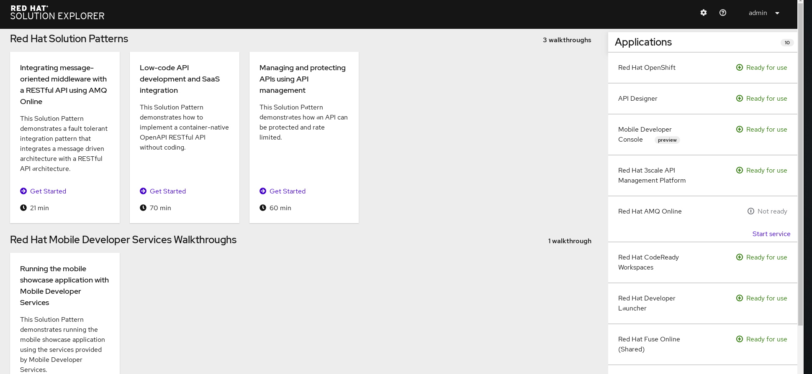

# Solution Explorer

This Repository explain how to use Solution Explorer to implement integrated solutions using redhat middleware applications .

### Step 1: Design API 

we will use Red Hat's Apicurio and desing the API definition based on the OpenAPI Specification.

* Open the Solution Explorer
* Select the **API Designer** from **Applications** list and this will open the **Apicurito** 
* Next Follow  [Instructions how to design api using API Curio studio ](docs/Apicurio-docs.md)

### Step 2: Implement the API 

* Select the **Red Hat CodeReady** from **Applications** list and this will open the **Red Hat CodeReady Dashboard** 
* Next Follow  [Instructions how to design api using Red Hat CodeReady ](docs/CodeReady-doc.md)

  
### Step 3: Integrate the API

 Here is how to integrate a simple API example with Fuse online
 
 
* Select the **Red Hat Fuse Online** from **Applications** list and this will open the **Red Hat Fuse Online Login Page** 
* Next Follow  [Instructions how to integrate api using Red Hat Fuse Online ](docs/FuseOnline-doc.md)
  

### Step 4: Manage the API

Use 3scale API Management solution to enables protect and manage the APIs.

* Select the **Red Hat 3scale API** from **Applications** list and this will open the **3scale Login Page** 
* Next Follow  [Instructions how to Manage api using Red Hat Fuse Online ](docs/3scaleAPI-doc.md)
  

### Step 5: Secure/Consume API 

design web-app and secure with Red Hat Single Sign-On

-- 

   