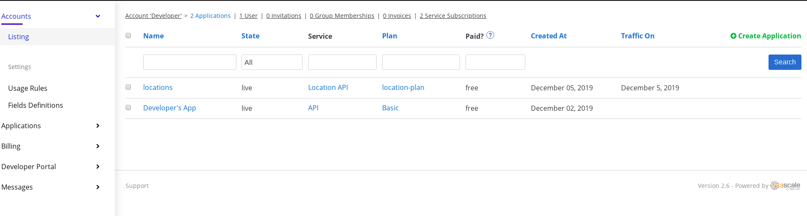

## Manage API with Red Hat 3Scale API Management

### Step 1: Create a NEW API

* Click on NEW API on 3scal Dashboard 

	Mention the below details:
	
	Name :Location API
	System Name : location-sso :
	
	
 
 
  
 * Create Application Plan with name **location-plan**
 
 * add an application to Application Plan by selecting **Accounts** from the dashboard and clicking on **create application**
 
  
 
 
 * select application plan name from drop-down as **location-plan** and give application name

  

* Click on **Integration** link and select **Configuration** and then click the link **add the base URL of your API and save the configuration**

  
  
  
  Add Below details:
  
  
  *Private Base URL* : Route of the location API deployed in openshift project  
  *API GATEWAY*-( you can get the details from 3scale openshift project by going inside the routes) 
  *Staging Public Base URL*  
  *Production Public Base URL*  
  *API test GET request*   write  ``/locations`` inside the text box.
  
  
  
  
  

* Click on **Update &amp; test in Staging Environment**

* Test API ``curl "https://rh-test-3scalefuse-1.staging.3scale.apps.ahameed-3d57.open.redhat.com:443/locations?user_key=79dd46c91bbf208056ac2b62a63e6104"``
