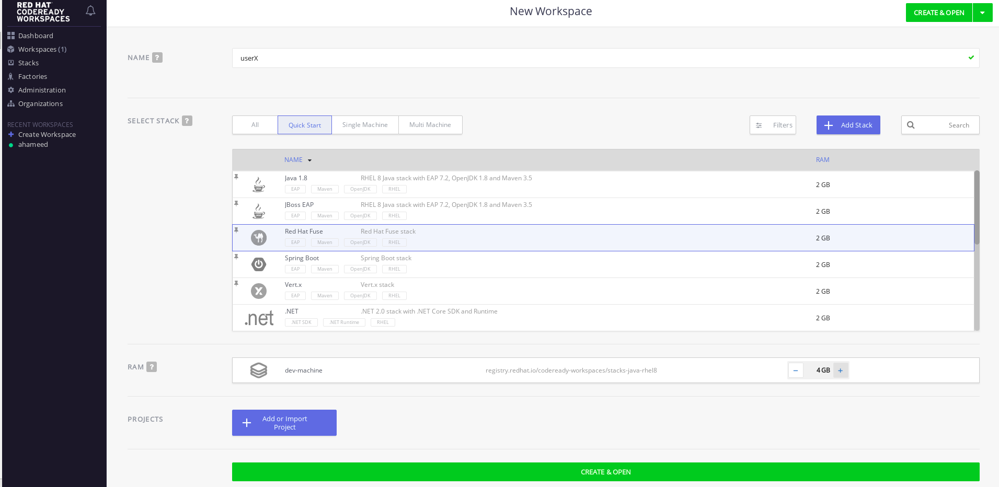
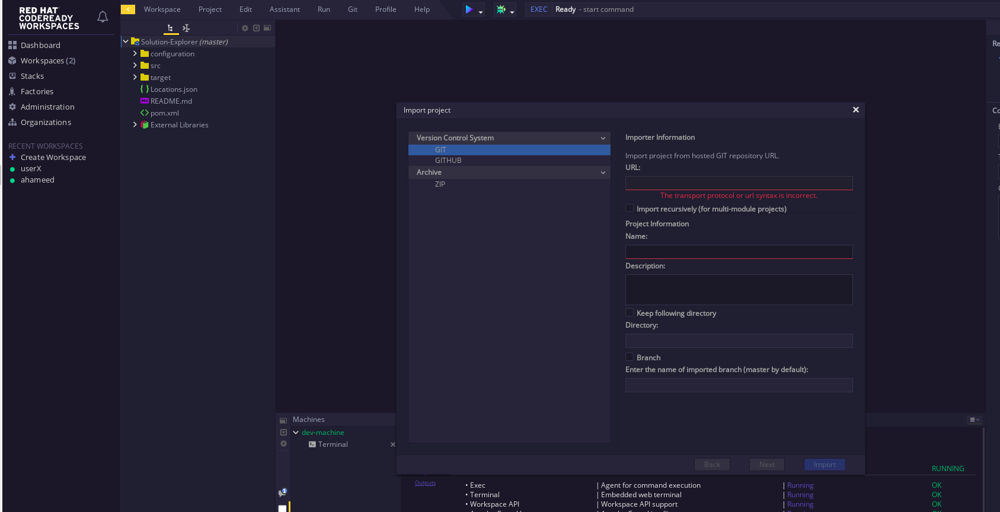
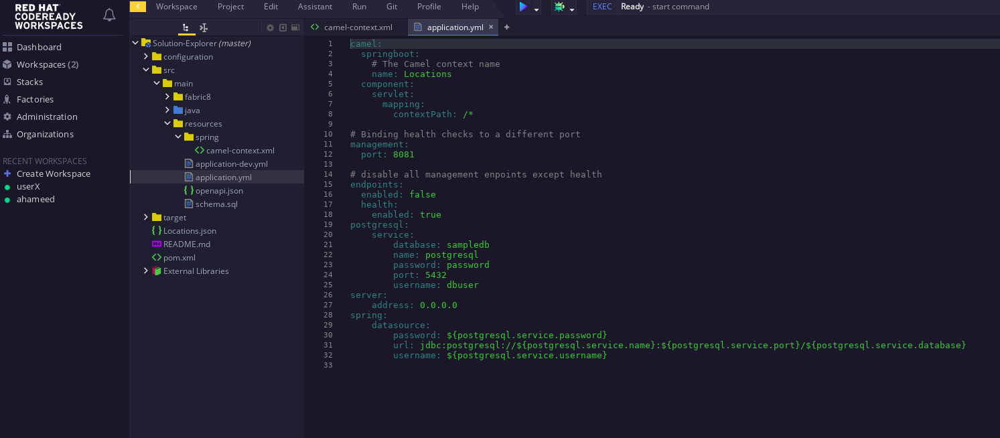
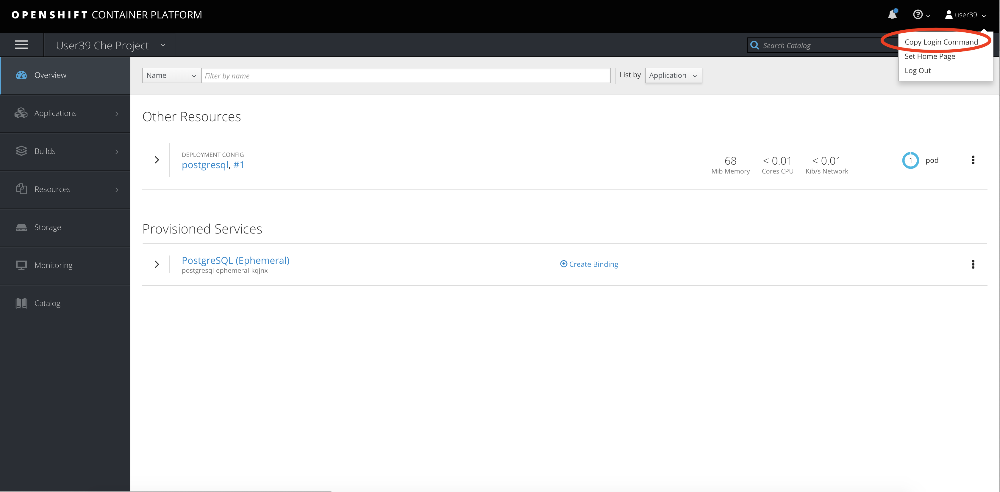

## Use Red Hat CodeReady to implement the service

Red Hat CodeReady Workspaces uses Kubernetes and containers to provide any member of the development or IT team with a consistent, secure, and zero-configuration development environment. The user experience is as fast and familiar as an integrated development environment (IDE) on their laptop.

###  Step 1: Create a code ready environment.

* Assuming you have opened the code ready application from solution explorer
* use your unique username as your workspace name.
* Select "Redhat Fuse" stack, increase the RAM to 4GB and then click Create.

 

* Click on Create to generate and open the workspace.
* Click on Open in IDE, and then  Click Start

### Step 3: Import the skeleton projects from Git 

assume that you have pushed the generated project into GitHub.

Click on Workspace > Import Project from the main menu. A pop-up will appear.

 
 
 
### Step 4: Complete Route implementation

 

you can find the complete implementation [here ](https://github.com/redhatHameed/Solution-Explorer)

### Step 5: Create your Openshift project and set up a sample database

* Open a solution explorer and click Red Hat Openshift

* create your unique namespace

* Click on Catalog on the left menu, then navigate to the Databases menu and select Postgres. From there, select the PostgreSQL (Ephemeral) template.

* the pop-up window that appears, click the Next button to reach the Configuration page.

* Update PostgreSQL Connection Username to dbuser and PostgreSQL Connection Password to password

* Click Next and ensure Do not Bind at this time is selected. Click Create to generate the service.

* update or make sure that the implementation project has the same configuration in the properties file. 

 
 
 
### Step 6: Run and  Deploy the project
 
 
 * Test the project locally, navigate Manage commands screen, double-click the run:spring-boot script and hit Run. The script will run locally in code ready.
 
 * Once SpringBoot has started-up, right-click the dev-machine (under Machines) and select Servers. Click the link corresponding to port 8080. A new tab should open ``/locations`` to the URI

* Next deploy it to our running OpenShift environment
* Navigate back to the OpenShift web UI and click the Copy Login Command link.

 

* Navigate back to Code Ready, open the terminal, and paste the login command from your clipboard. Once you've logged in, select the OpenShift project you used earlier using ``oc project <your project name>``

 

* To run the fabric8 Maven command to deploy our project, navigate back to the Manage commands screen, double-click the fabric8:deploy script.

Click Run. The script will run and deploy to your OCPPROJECT.

 
 
 
 * verify your service by ``<your openshift url>/locations`` or  can also search for individual locations by adjusting the URI to ``/locations/{id} e.g. /locations/100``

 
 
 

  