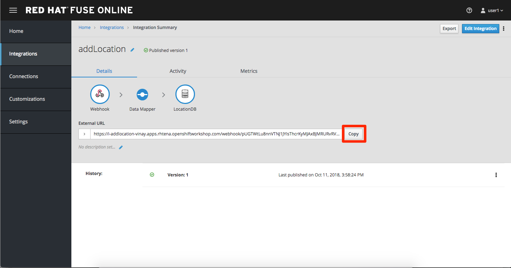

## Integrate with Fuse Online


### Step 1: Create database connection


* Assuming you have opened the Fuse Online application from solution explorer
* Click on **Connections > Create Connection**
* Select **Database** 
* Enter below values for Database Configuration

```
Connection URL: jdbc:postgresql://postgresql.OCPPROJECT.svc:5432/sampledb
Username      : dbuser
Password      : password
Schema        : <blank>

```
* Click Validate and verify if the connection is successful. Click Next to proceed.

* Add Connection details: Connection Name: LocationDB and Click Creat

### Step 2:Create webhook integration

* click on Integrations > Create Integration
* Choose Webhook
* Click on Incoming webhook
* It navigates to the Webhook Token screen. Click Next
* Define the Output Data Type.

``` 
 Select type from the dropdown as JSON instance.
 Enter Data type Name: Custom
 For Definition:, copy below JSON data.
 Click Done
 
 


jason {
  "id": 1,
  "name": "xxx",
  "type": "Regional Branch",
  "status": "1",
  "location": {
    "lat": "-28.32555",
    "lng": "-5.91531"
  }
} 
```

* Click on LocationDB from the catalog and then select Invoke SQL

```
INSERT INTO locations (id,name,lat,lng,location_type,status) VALUES (:#id,:#name,:#lat,:#lng,:#location_type,:#status )
```

* Click on Add Step and select Data mapper

* Drag and drop the matching Source Data types to all their corresponding Targets as per the following screenshot. When finished, click Done.


 
 
 * Click Publish on the next screen and add integration name: addLocation and publish again.
 
 
### Step 3: Create a POST request
 
 
  * Copy the External URL per the below screenshot
  
 
 
 
*  Run below the curl command and make sure to use your URL you copied and pasted
 
 
```
 curl -k --header "Content-Type: application/json"  
--request POST 
--data '{"id": 101, "name": "userxx", "type": "Regional Branch", "status": "1", "location": { "lat": "-28.32555", "lng": "-5.91531" }}' 
  https:/<fuse-copied-url>
   
```
 
  
* Click on Activity > Refresh and verify if the new record is created.


